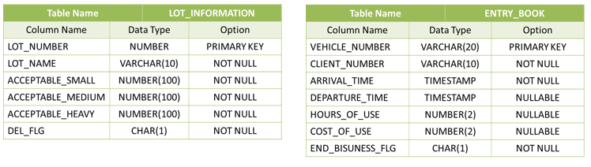

# Parking Area Management

1. SUMMARY
   - Management Parking Area
     - Check available area.
     - Check usage state by day.
     - Check income for day or date range.
     - Payment by Parking time and size of car.
     - Condition
       - Size of Car is different (Small, Middle, Big)
       - (TODO) Sales for Membership, Point

2. DATABASE
   - Tables
   
   </img> 

3. ETC
   - _Not Supported yet._
